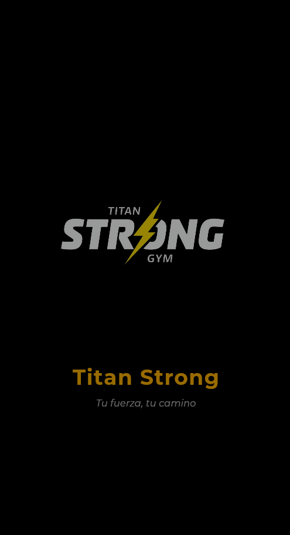
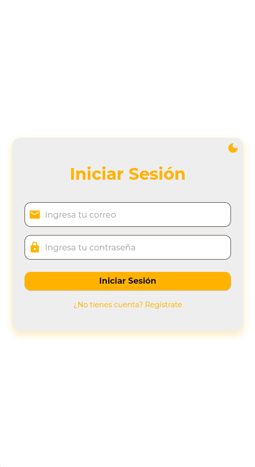
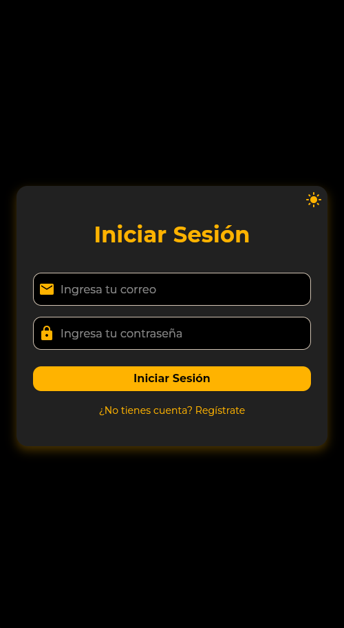
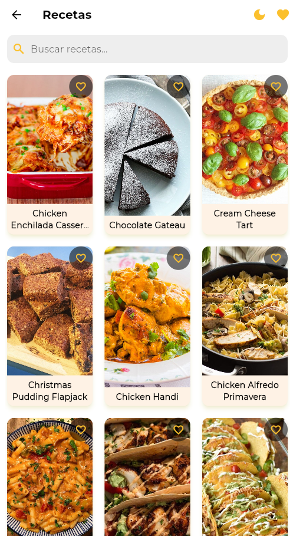
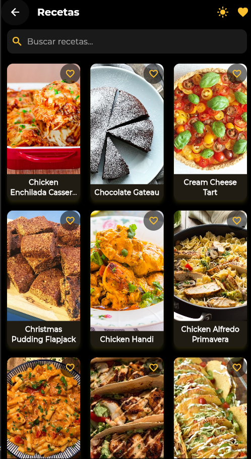
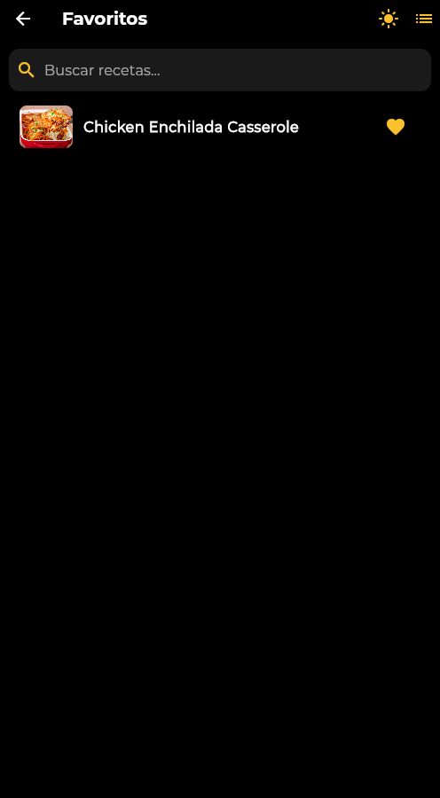

# Titan Strong App

## Descripción

Titan Strong es una aplicación móvil desarrollada en **Flutter** que permite a los usuarios registrarse, iniciar sesión, explorar recetas obtenidas desde una API pública y administrar sus recetas favoritas. La app incluye funcionalidades como **modo oscuro/claro**, **búsqueda de recetas**, y **favoritos**, ofreciendo una experiencia fluida y amigable en plataformas móviles Android y iOS.

---

## Tecnologías utilizadas

- **Framework:** Flutter  
- **Lenguaje:** Dart  
- **Gestión de estado:** Provider  
- **Consumo de API:** HTTP package  
- **Tipografía:** Google Fonts (Montserrat)  
- **Control de versiones:** Git  

---

## Características principales

- Registro e inicio de sesión de usuarios.  
- Visualización de recetas en **grid** y lista de favoritos.  
- **Modo oscuro y claro** con botón para alternar.  
- **Búsqueda de recetas** en tiempo real.  
- Gestión de favoritos.  
- Manejo de **estados de carga y errores**.  
- Navegación clara entre pantallas (Splash, Login, Registro, Recetas, Detalle de receta).  
- Pull to refresh para actualizar la lista de recetas.  

---

## Instalación y ejecución

1. Clonar el repositorio:

git clone https://github.com/usuario/titan-strong-app.gi

2.Entrar en el proyecto:

cd titan-strong-app

Instalar dependencias:

flutter pub get

Ejecutar la aplicación en un emulador o dispositivo físico:

flutter run

Nota: Asegúrate de tener Flutter instalado y configurado en tu máquina. Para más información visita Flutter Installation
.

# ESTRUCTURA

lib/
│─ models/
    ├─ meal.dart
│─ service/
    ├─ api_service.dart
├─ screens/
│   ├─ splash_screen.dart
│   ├─ login_screen.dart
│   ├─ registration_screen.dart
│   ├─ meals_screen.dart
│   └─ meal_detail_screen.dart
│
├─ theme_notifier.dart
├─ main.dart

# API utilizada

TheMealDB (https://www.themealdb.com/api.php)

Se utiliza el endpoint: https://www.themealdb.com/api/json/v1/1/search.php?f=c para obtener recetas.

## Capturas de pantalla

### Pantalla de splash

### Pantalla de Login

### Pantalla de Recetas

### Favoritos

Pantalla de Splash

Pantalla de Login / Registro

Pantalla de Recetas en modo Grid

Lista de Favoritos

Detalle de una receta

# Funcionalidades futuras

Filtrado por categorías de recetas.

Compartir recetas con amigos.

Agregar notas personales a recetas favoritas.

Implementar autenticación real con Firebase.

Autor

Juan Goyeneche – Estudiante de Ingeniería Multimedia
[Correo de contacto: juangoyen24@gmail.com
]
[GitHub: https://github.com/usuario
]
